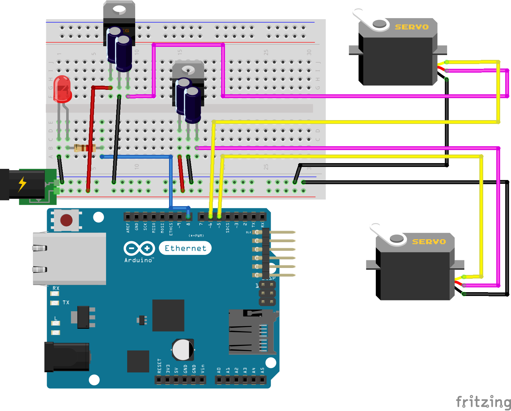

# About
automated-oven contains models and code to implement a mount for a 1980s era Hotpoint electric range to control an oven with a smartphone. 

# Building
To compile the code to machine readable form you will need to download and install the Arduino IDE
https://www.arduino.cc/en/Main/Software
You will also need to download and install OpenSCAD to render the 3D models:
http://www.openscad.org/downloads.html

You will need to order the parts listed in oven-project-parts.xml, 3D print the shapes in models and assemble the circuit below. 

Lastly, you will need to upload the contents of app/ and server-code/ to a PHP enabled web server and replace the byte array _server_ in firmware.ino with the IP address to your server. 

# License
automated-oven is free software: you can redistribute it and/or modify
it under the terms of the GNU General Public License as published by
the Free Software Foundation, either version 3 of the License, or
(at your option) any later version.

automated-oven is distributed in the hope that it will be useful,
but WITHOUT ANY WARRANTY; without even the implied warranty of
MERCHANTABILITY or FITNESS FOR A PARTICULAR PURPOSE.  See the
GNU General Public License for more details.

You should have received a copy of the GNU General Public License
along with automated-oven.  If not, see <http://www.gnu.org/licenses/>.

# Contents
- oven-project-parts.xml is a spreadsheet containing an itemized list of the parts needed to create the mount.
- app/ contains an AJAX webpage a smartphone shall run to control the oven.
- firmware/ contains code that runs on the Arduino Ethernet. 
- models/ contains OpenSCAD models of the physical oven mounts that are rendered to .stl files and 3D printed.
- schematics/ contains a diagram of the power supply circuitry and servos and how they connect to the Arduino.
- server-code/ contains code that runs on a server that coordinates communication between the smartphone and the Arduino.

# Areas for Improvement
- The servos were underpowered and unreliable towards their outer reach <45 degrees and >135 degrees, I would like to get better servos with better reliability and more power. 
- The voltage regulator circuit was liable to overheating. It overheated so much that in a 90 degree shift of the Off/Bake knob it could no longer provide the power to push the knob back to its original state. The regulator should be redesigned. 
- There should be a way for the Arduino to cut power to the servos and there should be a way to know which direction the servos are pointed in before delivering power. 
- Encryption needs to be added to the product 