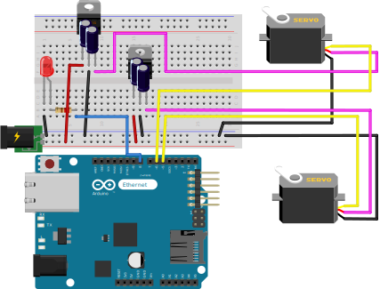

# About
automated-oven contains models and code to implement a mount for a 1980s era Hotpoint electric range to control an oven with a smartphone. 

# Building
To compile the code to machine readable form you will need to download and install the Arduino IDE
https://www.arduino.cc/en/Main/Software
You will also need to download and install OpenSCAD to render the 3D models:
http://www.openscad.org/downloads.html

You will need to order the parts listed in oven-project-parts.xml, 3D print the shapes in models and assemble the circuit below. 

# Contents
- oven-project-parts.xml is a spreadsheet containing an itemized list of the parts needed to create the mount.
- app/ contains an AJAX webpage a smartphone shall run to control the oven.
- firmware/ contains code that runs on the Arduino Ethernet. 
- models/ contains OpenSCAD models of the physical oven mounts that are rendered to .stl files and 3D printed.
- schematics/ contains a diagram of the power supply circuitry and servos and how they connect to the Arduino.
- server-code/ contains code that runs on a server that coordinates communication between the smartphone and the Arduino.